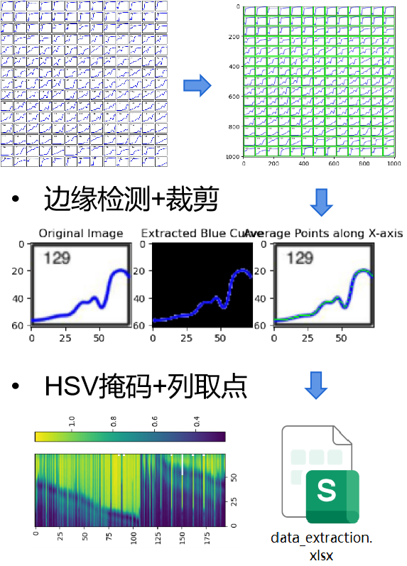
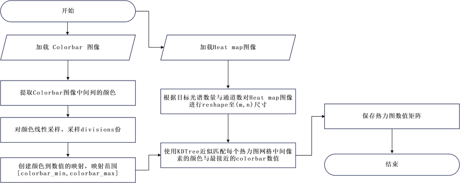
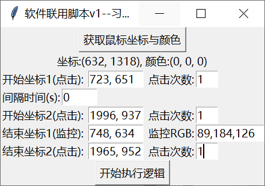

存放一些在日常科研中使用到的数据收集和处理的脚本，大致分为处理不同问题的几大类**`context(excel\txt等数据处理)`** 、**`image(图像\视频\图片数据预处理等)`** 、**`event(鼠标事件\串口通信)`**、 **`computation(科学计算指标)`** 。

> [GitHub仓库地址](https://github.com/similing-scholar/ResearchScripts.git)、[gitee仓库地址](https://gitee.com/similing-scholar/ResearchScripts.git)

tips：每个代码都有详细的注释，记录我的学习与思考过程。

## Context
- `excel_merge.py` pandas合并excel内容到新的excel中。

## Image
- `CameraSaveImage.py` opencv调用usb摄像头定时保存图像。
- `image_crop.py` steamlit可视化web进行图像裁剪并分别保存。
- `img_add_text.py` PIL将图片名称添加到图片左上角。
- `Image_Data_Extraction.py` opencv提取文献图片中的曲线数据。
- `Image_Data_Extraction_Heatmap.py` opencv提取文献图片中的热力图数据。
- `image_texture_features.py` skimage提取图片特征。
<table>
  <tr>
    <td></td>
    <td></td>
    <td></td>
  </tr>
</table>

## Event
- `Click_GUI.py` tkinter可视化窗口调用鼠标同时点击两个软件的开始按钮，并同时结束。
- `files_copy.py`os将根目录文件夹的子文件夹下的所有指定格式文件复制到新的文件夹中（建立对应的子文件夹）。
- `files_remove.py`os将根目录文件夹的子文件夹下的所有指定格式文件删除。

## Computation
- `img_correlation.py` 图像相邻像素相关性计算。
- `image_entropy.py` 图像熵计算。
- `image_PSNR.py` 图像峰值信噪比计算。